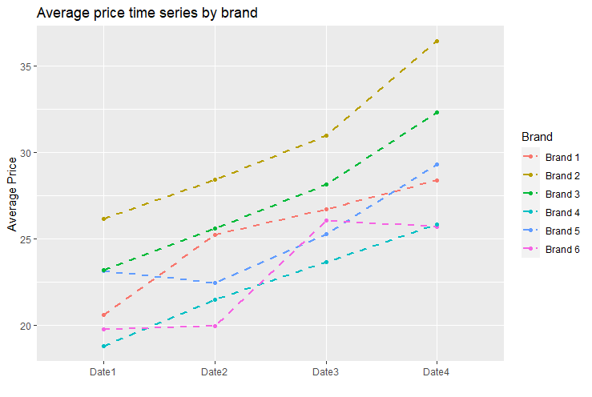
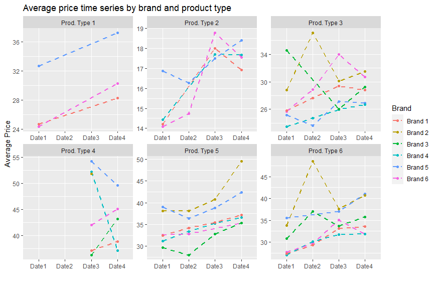
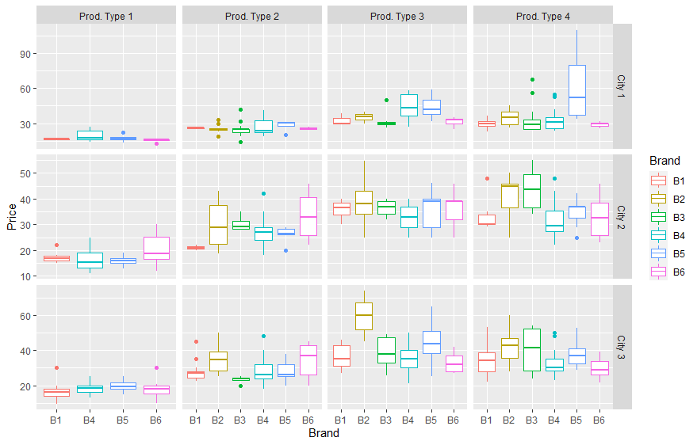
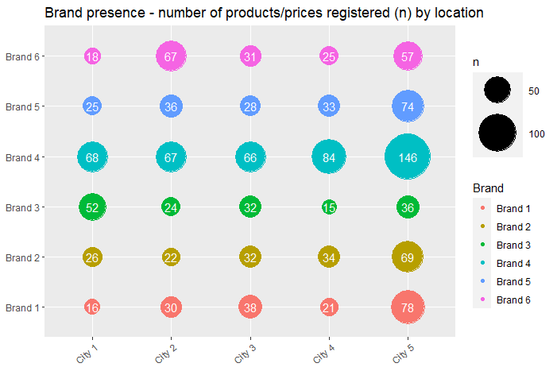
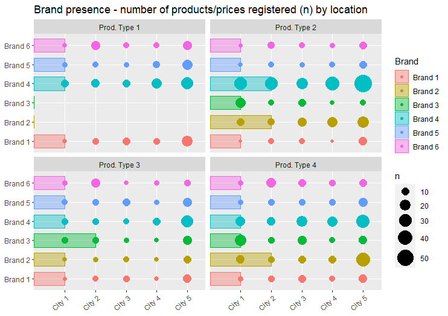
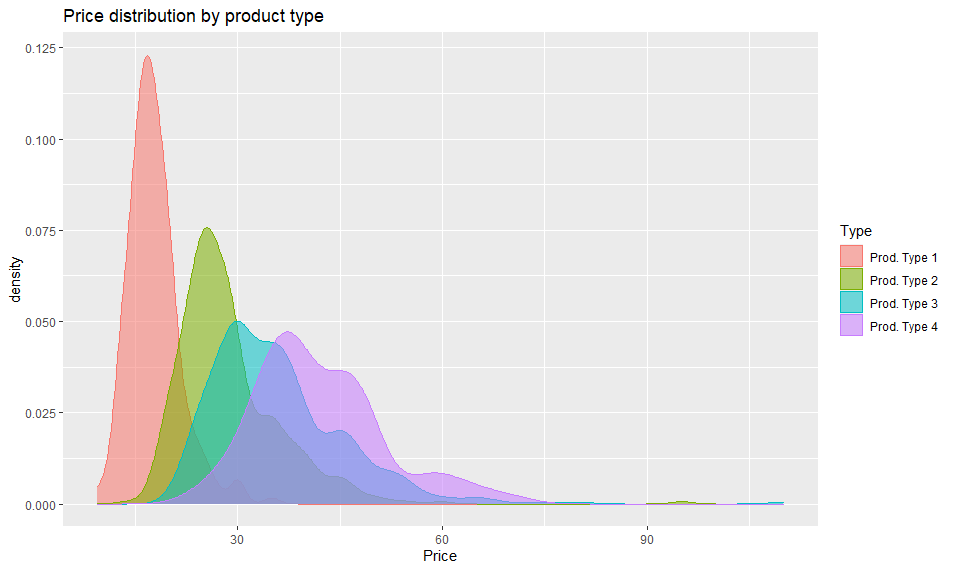
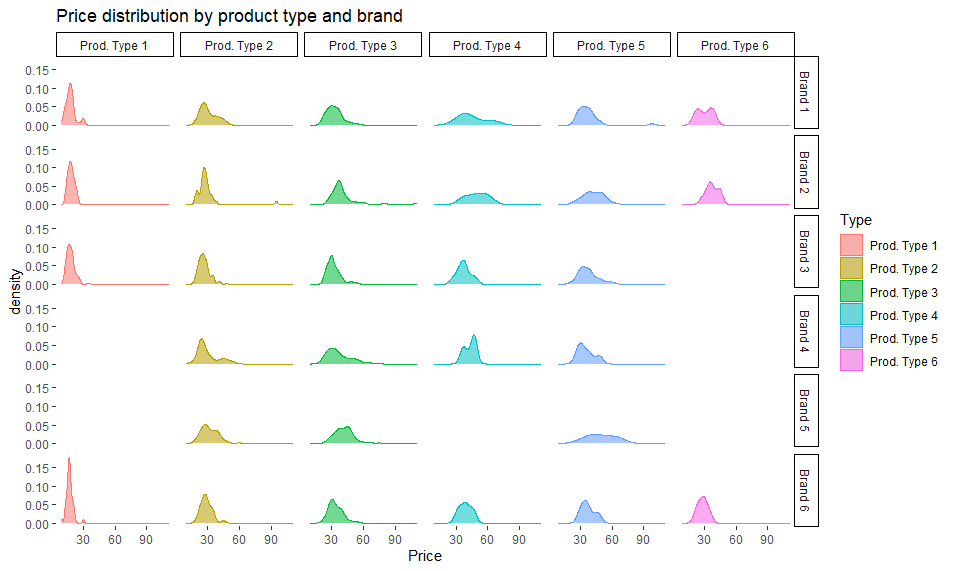

# ggplot2-snippets

Insightful ggplot2 charts used in data analysis in management consulting and market research projects.

## Price time series

Dataframe prototype

|Brand|Date|AvgPrice|
|---|---|---|
|Brand1|Date1|20.6|
|Brand1|Date2|20.6|
|Brand2|Date2|26.2| 

```R
ggplot(df, aes(x=Date, y=Price, group=Brand, color=Brand)) + 
 geom_line(size=1, linetype="dashed") +
 geom_point() +
 ggtitle("Average price time series by brand") + 
 ylab("Average Price") + xlab("")
```



## Price time series by brand and product type

Dataframe prototype
|Brand|Date|Type|AvgPrice|
|---|---|---|---|
|Brand1|Date1|Prod. Type 1|20.6|
|Brand1|Date2|Prod. Type 2|20.6|
|Brand2|Date2|Prod. Type 1|26.2|

```R
ggplot(df, aes(x=Date, y=AvgPrice, group=Brand, color=Brand)) + 
 geom_line(size=1, linetype="dashed") +
 geom_point() +
 ggtitle("Average price time series by brand and product type") + 
  ylab("Average Price") + xlab("") +
 scale_x_discrete(limits=c("Date1", "Date2", "Date3", "Date4")) +
 facet_wrap(~Type, scale="free")
```



## Price boxplots by brand, product type and location

Dataframe prototype
|Brand|City|Type|Price|
|---|---|---|---|
|Brand1|City1|Prod. Type 1|16.0|
|Brand1|City1|Prod. Type 2|25.5|
|Brand2|City2|Prod. Type 1|22.0|

```R
ggplot(df, aes(x=Brand, y=Price, color=Brand)) +
  geom_boxplot() +
  facet_grid(~City~Type, scale = "free")
```



## Brand presence as a count of identified products

The frequency of prices collected by brand can be understood as a proxy for the brand's presence at each location.


Dataframe prototype
|Product|Brand|City|Price|
|---|---|---|---|
|Product1|Brand1|City1|18.00|
|Product2|Brand1|City1|17.00|
|Product3|Brand2|City2|20.00|

```R
p <- 
ggplot(df, aes(y = City, x = Brand, color = Brand)) +
  ggtitle("Brand presence - number of products/prices registered (n) by location") +
  theme(axis.title.x=element_blank(), axis.title.y=element_blank()) +
  geom_count(aes(size = stat(n))) +
  scale_size_area(max_size = 20) +
  theme(axis.text.x = element_text(angle = 40, hjust = 1)) +
  coord_flip()

p + geom_text(data = ggplot_build(p)$data[[1]], 
              aes(x, y, label = n), color = "#ffffff")
```



## Brand presence - different sample sizes
If a brand has more than one product of the same type/category, it is possible to add that information by indicating how many products were researched per brand. The size of the horizontal bar represents that number.


Dataframe prototype - df
|Product|Brand|City|Price|Type
|---|---|---|---|---|
|Product1|Brand1|City1|18.00|Prod. Type 1|
|Product2|Brand1|City1|17.00|Prod. Type 2|
|Product3|Brand2|City2|20.00|Prod. Type 1|

Dataframe prototype - brand_products
|Type|Brand|Num.Products|
|---|---|---|
|Prod. Type 1|Brand1|1|
|Prod. Type 2|Brand1|1|
|Prod. Type 2|Brand2|2|


```R
ggplot(df, aes(y = City, x = Brand, color = Brand)) +
  ggtitle("Brand presence - number of products/prices registered (n) by location") +
  theme(axis.title.x=element_blank(), axis.title.y=element_blank()) +
  geom_count(aes(size = stat(n))) +
  scale_size_area(max_size = 10) +
  theme(axis.text.x = element_text(angle = 40, hjust = 1)) +
  geom_bar(data = brand_products, aes(x = Brand, y = Num.Products, fill = Brand),width =0.7,  alpha = 0.4, stat = "identity") +
  facet_wrap(~Type) +
  coord_flip()
```



## Price distribution by product type

Dataframe prototype
|Brand|Type|Price|
|---|---|---|
|Brand1|Prod. Type 1|18.00|
|Brand1|Prod. Type 2|17.00|
|Brand2|Prod. Type 1|20.00|

```R
ggplot(df, aes(Price, colour=Type, fill=Type)) + 
  ggtitle("Price distribution by product type") +
  geom_density(alpha=0.55)
```


## Price distribution by product type and brand

Dataframe prototype
|Brand|Type|Price|
|---|---|---|
|Brand1|Prod. Type 1|18.00|
|Brand1|Prod. Type 2|17.00|
|Brand2|Prod. Type 1|20.00|

```R
ggplot(df, aes(Price, colour=Type, fill=Type)) + 
  ggtitle("Price distribution by product type and brand") +
  geom_density(alpha=0.55) +
  theme(panel.background = element_rect(fill = 'white')) +
  theme(strip.background =element_rect(color="black", fill="white", linetype="solid" )) +
  facet_grid(~Brand~Type)
```

